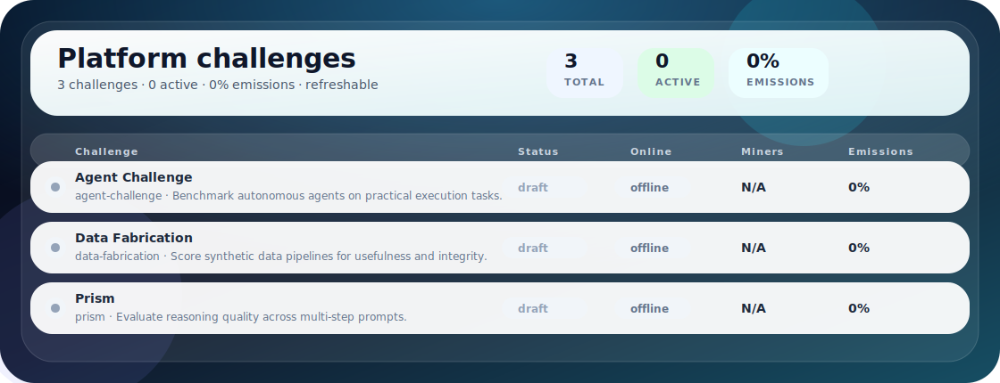
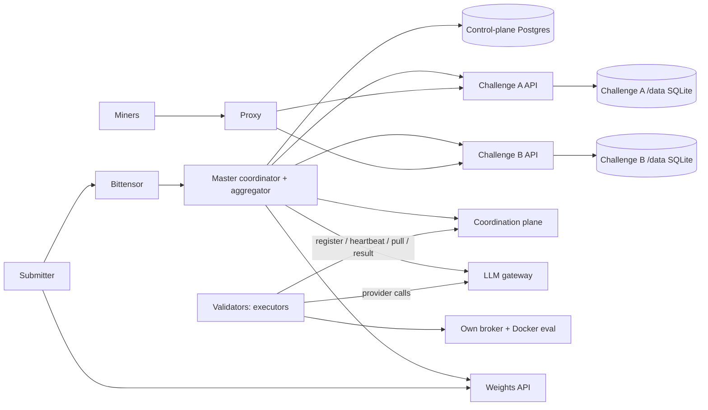
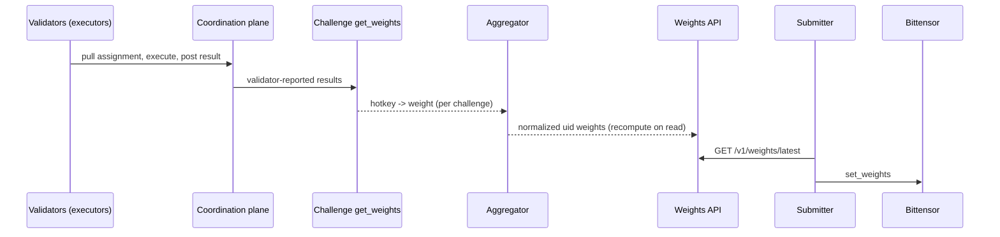

<div align="center">

# BASE

**Multi-challenge Bittensor subnet platform with master/validator orchestration**

**[Miner Guide](docs/miner/README.md) • [Validator Guide](docs/validator/README.md) • [Foundation Master Guide](docs/master/README.md) • [Architecture](docs/architecture.md) • [Challenges](docs/challenges.md) • [Security](docs/security.md) • [Website](https://joinbase.ai)**

[](https://github.com/BaseIntelligence/base/actions/workflows/ci.yml)
[](https://github.com/BaseIntelligence/base/blob/main/LICENSE)
[](https://bittensor.com/)




</div>

---

## Overview

BASE is a **multi-challenge Bittensor subnet platform**. It lets independent challenge
subnets run under one validator network, routes miner traffic to the right challenge, collects raw
challenge weights, normalizes emissions, maps miner hotkeys to Bittensor UIDs, and publishes the
final vector for validators to submit on-chain.

Each challenge lives in its own repository and owns its submissions, scoring logic, state, and
public miner experience. BASE provides the orchestration layer that makes those challenges run
together as one subnet.

BASE runs as a single Docker Swarm: a master (manager) node hosts the platform API (a single
proxy that also serves the `/v1/registry` and `/v1/weights/latest` reads plus the token-gated admin
routes), the validator coordination plane, the LLM gateway, broker, supervisor, and the challenge
API services. The master coordinates and aggregates only; it never executes evaluation tasks.
Online validators are the decentralized executors: each registers with the master, pulls
assignments, and runs evaluation on its own broker and Docker. There is no Kubernetes and no
`runtime.backend` selector; the only backend is Swarm.

## Core Principles

- One **BASE master** (Swarm manager) coordinates and aggregates; it never executes evaluation tasks.
- Online **validators** are the decentralized executors; they pull assignments from the master and run evaluation on their own broker and Docker.
- Validator-facing routes are hotkey-signed and gated on a metagraph validator permit.
- All provider (LLM) calls go through the master LLM gateway; validators hold no provider keys.
- Weights are computed from validator-reported evaluation results; there is no path that produces weights without validator evaluation.
- One repository and image per **challenge**, isolated from other challenges.
- Challenges expose a standard internal weight contract to BASE.
- Public challenge APIs are proxied through BASE without exposing internal control routes.
- The shared control-plane PostgreSQL is private to the master process.
- Each challenge keeps its own SQLite database on its `/data` Swarm volume.
- Challenge state remains owned by each challenge.
- The master node runs all active challenge services; the on-chain submitter only submits weights.

---

## Documentation Index

Docs are grouped by audience.

**Miners**

- [Miner guide](docs/miner/README.md) — choose a challenge, submit through the proxy, and track leaderboards.

**Validators / operators**

- [Validator guide](docs/validator/README.md) — install the submit-only on-chain weight submitter.
- [Validator operations](docs/operations/validator.md) — submitter plus manager-service runbook.
- [Swarm deployment](deploy/swarm/README.md) — node `daemon.json` variants, worker enrollment, networking, prune policy, and the supervisor unit.
- [Foundation master guide](docs/master/README.md) — Cortex Foundation master bring-up (foundation-only).
- [Reward semantics](docs/reward-semantics.md) — reference spec for how the Terminal-Bench (harbor) scorer maps verifier output to a reward and submission status.
- [Deploy from scratch](#deploy-from-scratch-quickstart) — the end-to-end bring-up quickstart below.

**Developers / challenge integrators**

- [Architecture](docs/architecture.md) — control-plane versus worker topology and the Swarm broker contract.
- [Challenges](docs/challenges.md) — the challenge model.
- [Challenge integration guide](docs/challenge-integration.md) — the API contract a challenge must expose.
- [Security model](docs/security.md) — trust boundaries and secret handling.
- [Versioning](docs/versioning.md) — SemVer, Git tag, and GHCR tag policy.

---

## Network Architecture



---

## Weight Flow



---

## Decentralized Evaluation

The master is a coordinator and aggregator; it never executes evaluation tasks. Online validators
are the decentralized executors. These master subsystems (under `src/base/master/`, shipped in the
`base-master` image) make this work:

- **Validator registry and auth** (`validator_coordination.py`): `validators` and
  `validator_health_events` tables, hotkey-signed register and heartbeat endpoints gated on a
  metagraph validator permit, and edge-triggered crash/offline detection.
- **Assignment and coordination plane** (`assignment.py`, `assignment_coordination.py`): balanced
  least-loaded random assignment with capability routing and offline exclusion, plus pull-based
  coordination (pull, progress, result) over the `work_assignments` and `work_results` tables, with
  reassignment on crash or deadline.
- **Orchestration driver** (`orchestration.py`): a live loop that bridges challenge pending work
  into assignments, runs the assignment and reassignment passes, and durably folds retry-exhausted
  units so the system runs autonomously.
- **LLM gateway** (`llm_gateway/`): injects provider keys server-side and meters usage; validators
  and eval runtimes hold no provider keys and authenticate with a per-assignment scoped gateway
  token issued at pull time. It routes DeepSeek (agent execution) and OpenRouter (review gates) and
  redacts secrets in logs.
- **Weights aggregation and single submitter**: `/v1/weights/latest` is recomputed on read from the
  validator-reported `get_weights` of each active challenge (a multi-challenge emission-share blend
  with a zero-miner burn fallback); the single submitter validates freshness and netuid and submits
  once (dry-run and mock supported). There is no path that produces weights without validator
  evaluation.

Validators run the validator agent runtime (`base.validator.agent`, with hotkey signing, a
coordination client, and an executor seam). New CLI entrypoints:

- `base master proxy` runs the single public API plus the coordination plane, LLM gateway, and
  orchestration driver.
- `base validator agent` runs the decentralized own-broker executor: it registers and heartbeats,
  pulls assignments, executes them locally, routes provider calls through the master gateway, and
  posts results.

Control-plane migrations advance through alembic head `0007` (validator registry, LLM usage
records, work assignments and results, and registry hardening).

### No-chain (mock-metagraph) decentralized deploy

BASE can run the full decentralized coordination plane and validators **without a live Subtensor**,
for staging or a no-chain production bring-up. A config-driven static metagraph
(`network.mock_metagraph` in `master.yaml`, or the installer's `MOCK_METAGRAPH` env) lists the
eligible validator hotkeys; when set, the bittensor runtime factory seeds the metagraph cache from
that static set and never constructs a live Subtensor, so the listed validator hotkeys pass the
hotkey-signed eligibility auth with no chain. It is **DEFAULT OFF** (inert/behaviour-preserving when
unset) and miners stay submit-eligible via the `upload_extra_registered_hotkeys` allowlist,
independent of the metagraph.

Run N decentralized validator agents against such a master with the
[`deploy/swarm/validator.yaml`](deploy/swarm/validator.yaml) template: copy it to
`validator-1.yaml` / `validator-2.yaml` / … (one DISTINCT `network.wallet_name` hotkey and the right
`capabilities` per validator, each listed in the master's `mock_metagraph` with
`validator_permit=true`) and run one `base validator agent --config <file>` per validator. Exactly
one validator should advertise `gpu` on a single-GPU cluster (it receives the prism GPU re-exec,
concurrency 1); the others advertise `cpu` (agent-challenge Terminal-Bench tasks). See
`deploy/swarm/README.md` "Running N decentralized validator agents".

---

## What BASE Does

BASE coordinates the full lifecycle of a multi-challenge subnet:

1. The master tracks active challenges and their emission shares.
2. The master (manager) node runs the active challenge services from the registry.
3. Challenge services run isolated from the control plane and from each other, each on its own `/data` Swarm volume.
4. Miners interact with the relevant challenge through BASE's public proxy.
5. Online validators register with the master, pull assignments from the coordination plane, execute evaluation on their own broker and Docker, and post results.
6. Each challenge computes raw hotkey weights from those validator-reported results using its own scoring rules.
7. BASE normalizes challenge outputs, applies configured emissions, and maps hotkeys to UIDs.
8. The on-chain submitter fetches the master's final vector and submits weights to Bittensor at epoch boundaries.

If a challenge fails, BASE can isolate that challenge's contribution without taking down the
entire subnet.

## Roles

### Miners

Miners choose a challenge, follow that challenge's submission rules, and monitor challenge-specific
leaderboards through BASE.

### Challenge Owners

Challenge owners maintain independent repositories, images, scoring logic, public documentation, and
weight contracts.

### Validators

Validators are the decentralized executors. Each runs the validator agent (`base validator agent`):
it hotkey-registers and heartbeats with the master, pulls assignments from the coordination plane,
executes evaluation on its own broker and Docker, routes all provider calls through the master LLM
gateway, and posts results. A single on-chain submitter, separate from the executors, fetches the
master's final normalized vector from the weights API and submits it to Bittensor. Challenge API
services are run by the master (manager) node.

---

## Repository Layout

```text
platform/
  src/base/      # CLI, APIs, orchestration, Bittensor wrappers
  alembic/                   # PostgreSQL migrations
  config/                    # YAML example configs
  docker/                    # Dockerfiles and OCI image assets
  docs/                      # Project, miner, validator, and challenge docs
  plan/                      # Detailed design plan
  tests/                     # Unit/runtime validation tests
```


## Deployment Policy

BASE uses a Docker Swarm only first-party deployment path and keeps Dockerfiles for the OCI images Swarm runs:

- `deploy/swarm/install-swarm.sh` brings up the single-node Swarm manager (master proxy, broker, and challenge services on encrypted overlay networks). It is **dry-run by default**, mutates only with `--apply`, and keeps every destructive step behind its own explicit flag (`--restart-dockerd`, `--single-node-placement`, `--static-challenges`).
- `deploy/swarm/base-supervisor.service` installs the manager-only systemd supervisor: broker-health, timeout-reaper, image-updater, challenge-image-updater, config-sync, and self-update loops.
- The master (manager) node runs the challenge services with the placement constraint `node.role==manager`. The broker dispatches CPU jobs to `node.labels.base.workload==cpu` workers and GPU jobs (`gpu_count>0`) to `node.labels.base.workload==gpu` workers with `--generic-resource NVIDIA-GPU=<N>`.
- Worker nodes are enrolled manually with Swarm join tokens (no SSH) via the `base master worker` CLI group: `worker token [--cpu|--gpu]` prints `docker swarm join --token <TOKEN> <MANAGER_IP>:2377`; after the operator installs the matching `daemon.json` and joins, `worker label <node> --workload cpu|gpu` sets the scheduling label. The group also has `worker list`, `worker drain`, `worker rm`, and `worker inspect`.
- Control-plane state is a single shared PostgreSQL supplied via `BASE_DATABASE_URL` or a Docker secret; SQLite is rejected for control-plane state. Each challenge keeps its own SQLite database on its `/data` Swarm volume; there is no Postgres server per challenge.
- The on-chain submitter (`deploy/swarm/submitter/`) is a systemd service that reads `/v1/weights/latest` and submits on-chain; it runs no challenge orchestration.
- The validator coordination plane (validator registry, hotkey-signed register/heartbeat/pull/progress/result, crash detection, and the orchestration driver) and the LLM gateway ship inside the `base-master` image and are wired by `install-swarm.sh`. The gateway requires a mandatory token-signing secret at `/run/secrets/gateway_token_secret` (`GATEWAY_TOKEN`), real-mode provider keys, and an advertised gateway base URL (`gateway.public_base_url`, set via `GATEWAY_PUBLIC_BASE_URL`); the proxy fails closed without the token secret.
- Decentralized validator nodes run the validator agent (`base validator agent`) with their own broker and Docker. They authenticate with a hotkey signature plus a metagraph validator permit and reach providers only through the master gateway using a per-assignment scoped gateway token; no provider key is distributed to validators.
- The prism HuggingFace checkpoint publisher reads an optional `HF_TOKEN` (the `base_hf_token` secret mounted at `/run/secrets/hf_token`); when it is absent, publishing is skipped.
- The supervisor image-updater and challenge-image-updater are the **canonical first-party GHCR auto-update path**. They resolve the GHCR tag digest and roll Swarm services to `tag@sha256:<digest>` only when the digest changes from `ghcr.io/baseintelligence/base-master:latest`, and are a no-op when current. The resolver authenticates to GHCR (HTTP Basic against the token realm, from explicit credentials or the `auth` field of a docker `config.json`) so it can resolve **private** `ghcr.io/baseintelligence/*` digests; with no credentials it falls back to the anonymous public-package path, behaviour-preserving when unset. The master digest-pin rollout targets the installer-created service names `base-master-proxy` and `base-docker-broker`. Master/supervisor self-update is explicit: wired via `SUPERVISOR_SELF_UPDATE_MANIFEST_URL`, otherwise safely disabled (`supervisor.self_update_enabled=false`) with no inert half-state.
- Pinned production mode uses a tag plus a `sha256` digest, for example `ghcr.io/baseintelligence/demo:1.2.3@sha256:<64-hex-digest>` for releases or `ghcr.io/baseintelligence/demo:latest@sha256:<64-hex-digest>` for the autonomous update channel, and disables mutable auto-update. Production rejects untagged images, missing digests, and non-SemVer non-`latest` tags. BASE release versioning starts at `3.0.0`; see `docs/versioning.md` for the SemVer, Git tag, mutable `latest`/`main`, and GHCR tag policy.
- Swarm networking uses encrypted overlay networks at MTU 1450. Required inter-node ports: `2377/tcp` (management), `7946/tcp+udp` (gossip), `4789/udp` (VXLAN data plane), and IP protocol 50 (ESP) for the encrypted overlay.
- Swarm services map CPU and memory to `--limit-cpu` and `--limit-memory` and PID ceilings to `--limit-pids`. `docker service create` does not support `--memory-swap` or `--security-opt`, so swap limits are not emitted and `no-new-privileges` is enforced daemon-wide via `daemon.json`.
- Broker image allowlists should stay scoped to `ghcr.io/baseintelligence/` unless a deployment explicitly adds another trusted registry namespace.

See `deploy/swarm/` for the installer, supervisor unit, submitter, and `daemon.json` templates that define the production deployment.

## PRISM Evaluation Data Plane

PRISM GPU evals re-execute the miner's training loop on locked FineWeb-Edu data under a forced random init. The broker delivers that locked data to the eval container through a **per-slug read-only mount** mechanism (`SwarmBrokerConfig.eval_readonly_mounts_by_slug` in `master/swarm_backend.py`, settings `docker.broker_eval_readonly_mounts_by_slug`, wired in `cli_app/main.py`) that is decoupled from the Docker-socket allowlist, so the prism eval job receives the data without the (root-equivalent) host Docker socket.

- Every prism GPU eval job bind-mounts the locked FineWeb-Edu **train** volume (`prism_fineweb_edu_train` → `/data/fineweb-edu/train`) and the offline reference tokenizers (`prism_reference_tokenizers` → `/opt/prism/reference-tokenizers`) **read-only**, via the built-in `DEFAULT_PRISM_EVAL_READONLY_MOUNTS` (no `master.yaml` entry required).
- Only the `train` split is exposed; the secret `val`/`test` held-out splits are never mounted into the eval container, which runs `network=none` on an internal overlay and carries no OpenRouter secret.

`deploy/swarm/install-swarm.sh` canonicalizes the PRISM v2 eval-plane deploy wiring on the challenge service:

- **Evaluator image** — `IMAGE_PRISM_EVALUATOR` defaults to the CI-published `ghcr.io/baseintelligence/prism-evaluator` image pinned by digest (`@sha256:<digest>`) and is passed as `PRISM_BASE_EVAL_IMAGE`. The published evaluator image already bundles `sentencepiece` + the offline tiktoken cache the locked pipeline needs, so no separately built tag is required.
- **Host-side held-out** — the manager-pinned prism scorer (not the `network=none` eval container) mounts the SECRET val split read-only (`prism_fineweb_edu_val` → `/secret/val`) and reads it via `PRISM_BASE_EVAL_VAL_DATA_DIR=/secret/val` for the held-out delta; the held-out is gracefully skipped if val is absent.
- **OpenRouter LLM hard gate** — `PRISM_LLM_REVIEW_ENABLED=true`; the key is mounted on the challenge service ONLY at `/run/secrets/openrouter_api_key` (from the `base_openrouter_api_key` Docker secret), never on the eval container.

See `deploy/swarm/README.md` for the full broker mount mechanism and deploy details.

## Validation Quick Reference

Run these commands from the repository root when validating the platform locally. The live Swarm checks require Docker. If a tool is missing, record the bounded blocker rather than claiming that surface was tested.

```bash
uv sync --extra dev --extra master
uv run ruff check .
uv run ruff format --check .
uv run mypy src tests
uv run pytest -m "not postgres" --cov=base --cov-report=term-missing --cov-fail-under=80

# Postgres integration tests (require a reachable database; no credentials in the repo):
BASE_TEST_DATABASE_URL=<postgres-url> uv run pytest -m postgres

bash -n deploy/swarm/install-swarm.sh
./deploy/swarm/install-swarm.sh            # dry-run: prints the planned docker swarm commands, changes nothing
```

For a live single-node check (mutating; run only on a disposable host):

```bash
docker swarm init
docker network create --driver overlay --opt encrypted \
  --opt com.docker.network.driver.mtu=1450 base_challenges
docker service ls
docker swarm leave --force
```

Evidence for local validation should live in a local, gitignored evidence directory and must not contain tokens, credentialed database URLs, private registry credentials, bearer secrets, or private keys.

---

## Deploy from Scratch (Quickstart)

This is the end-to-end path to stand up the full subnet on a fresh Docker Swarm: a manager node
(control plane plus the long-lived challenge services) and one or more CPU/GPU workers (short-lived
broker eval jobs). It ties together image builds, image publishing/staging, volume provisioning,
`install-swarm.sh --apply`, worker enrollment, and the on-chain submitter. Weights are always
computed **dry-run**; the on-chain submitter is a separate, optional step. Run `install-swarm.sh`
**dry-run first** (no flags) and only `--apply` on a host you own.

The three backend repositories are sibling checkouts under a common parent
(`platform/`, `agent-challenge/`, `prism/`); the frontend deploys separately to Vercel.

### Topology and ports

| Node | Swarm role | Runs |
|------|------------|------|
| Manager (also the validator / hotkey node) | `node.role==manager` | Control plane (proxy / broker / supervisor) **and** the challenge services (agent-challenge, PRISM) |
| CPU worker | `node.labels.base.workload==cpu` | Short-lived CPU broker jobs |
| GPU worker | `node.labels.base.workload==gpu` | Short-lived GPU broker jobs; advertises `NVIDIA-GPU` as a Swarm generic resource |

The manager control-plane services are published on fixed host ports by
`install-swarm.sh --apply` (overridable via the `MASTER_PROXY_PORT` /
`MASTER_BROKER_PORT` env vars; the defaults below match the live box):

| Manager service (host-published) | Host port |
|---------|-----------|
| base-master-proxy (single public API; serves `/v1/registry`, `/v1/weights/latest`, `/health`, and routes `/challenges/*`) | 18080 |
| base-docker-broker | 8082 |

`/v1/registry` and `/v1/weights/latest` are served by the proxy on `18080`; there
is no separate admin service or port.

The challenge services and the Postgres backing stores are **overlay-internal**
(no host publish): clients reach the challenges **through the proxy** over the
`base_challenges` overlay (e.g. `http://127.0.0.1:18080/challenges/prism/...`),
and the master reaches Postgres by service name. They listen on their container
ports only:

| Overlay-internal service (reached via the proxy / by service name) | Container port |
|---------|-----------|
| challenge-agent-challenge (plus worker sidecar) | 8000 |
| challenge-prism (SQLite-backed) | 8080 |
| base-master-postgres (control plane) | 5432 |
| challenge-agent-challenge-postgres | 5432 |
| challenge-prism-postgres | 5432 |

> The **live box** additionally exposes some of these on the host for **direct
> debugging only** (not the canonical client path): prism on `18002`,
> agent-challenge on `18001`, and the Postgres stores on `15432` / `15433` /
> `15434`. Production clients always go through the proxy.

GPU eval jobs are dispatched by the broker to a GPU worker via the constraint
`node.labels.base.workload==gpu` plus `--generic-resource NVIDIA-GPU=<N>`.

### Step 1 — Build the images

Build from each repo's Dockerfile. `<tag>` is your release tag (a SemVer such as `3.0.0`, or
`latest` for the mutable channel).

```bash
# base-master (this repo): proxy (single public API) + broker + supervisor
docker build -f docker/Dockerfile.master -t ghcr.io/baseintelligence/base-master:<tag> .

# prism API + GPU evaluator (from ../prism)
docker build --target service   -t ghcr.io/baseintelligence/prism:<tag> ../prism
docker build --target evaluator -t ghcr.io/baseintelligence/prism-evaluator:<tag> ../prism

# agent-challenge API + own_runner eval-job image (from ../agent-challenge)
docker build --target runtime               -t ghcr.io/baseintelligence/agent-challenge:<tag> ../agent-challenge
docker build --target terminal-bench-runner -t ghcr.io/baseintelligence/agent-challenge-terminal-bench-runner:<tag> ../agent-challenge
```

The prism evaluator image bundles `sentencepiece` and the offline tiktoken cache the locked
FineWeb-Edu pipeline needs; the CI-published `prism-evaluator` image bakes these in, so deployments
pin it by digest (Step 4) rather than building a separate tag.

> **Build-order coupling:** prism pins its `base` dependency by git
> (`base @ git+https://github.com/BaseIntelligence/base.git`, public HEAD), so a fresh
> `prism` build bundles whatever is on the **pushed** platform HEAD. Push the platform commits the
> prism/broker images depend on **before** building `prism` / `prism-evaluator`.

### Step 2 — Publish or stage the images

- **GHCR publish (preferred):** `docker push` each tag to `ghcr.io/baseintelligence/*`. Public
  packages need no pull secret; the supervisor image-updaters then track digests automatically.
- **Local-only staging (no `write:packages`):** build each image on the node that runs it (manager
  for the services, GPU/CPU workers for the eval images), and deploy with
  `docker service update --no-resolve-image` so a non-registry tag resolves to the node-local image.
  Pre-pull/stage the prism evaluator and the agent-challenge runner on the worker nodes so the broker
  resolves them locally.

### Step 3 — Provision named volumes and secrets

On the **GPU worker**, stage the locked PRISM data and reference tokenizers as read-only volumes
(produced by prism's FineWeb-Edu prep job; see the prism repo):

- `prism_fineweb_edu_train` → `/data/fineweb-edu/train` (miner-visible, read-only)
- `prism_fineweb_edu_val`, `prism_fineweb_edu_test` → secret held-out, scorer-only (never mounted in
  the `network=none` eval container)
- `prism_reference_tokenizers` → `/opt/prism/reference-tokenizers`

On the **manager**, provision the agent-challenge read-only task cache and golden volumes:

```bash
deploy/swarm/acquire-agent-challenge-cache.sh   # populates agent_challenge_task_cache + agent_challenge_golden
```

Verify each volume is both present **and populated** (a Docker named volume is auto-created empty on
first mount, so an empty mount succeeds silently). Provide the OpenRouter key for the PRISM/agent
LLM gate as the Docker secret consumed at `/run/secrets/openrouter_api_key` (the installer creates
`base_openrouter_api_key` from `$OPENROUTER_API_KEY`); the eval containers never carry it.

### Step 4 — Bring up the manager with `install-swarm.sh`

`deploy/swarm/install-swarm.sh` is the canonical entry point. It is **dry-run by default** and
mutates only with `--apply`; every destructive step is behind its own flag. Point the image tags at
what you built/published via the `IMAGE_*` environment overrides:

```bash
export IMAGE_MASTER=ghcr.io/baseintelligence/base-master:<tag>
export IMAGE_PRISM=ghcr.io/baseintelligence/prism:<tag>
export IMAGE_PRISM_EVALUATOR=ghcr.io/baseintelligence/prism-evaluator:<tag>
export IMAGE_AGENT_CHALLENGE=ghcr.io/baseintelligence/agent-challenge:<tag>
export AGENT_CHALLENGE_RUNNER_IMAGE=ghcr.io/baseintelligence/agent-challenge-terminal-bench-runner:<tag>

./deploy/swarm/install-swarm.sh                         # dry-run: prints the planned docker commands
./deploy/swarm/install-swarm.sh --apply                 # apply on a disposable / owned host
./deploy/swarm/install-swarm.sh --apply --restart-dockerd   # also write /etc/docker/daemon.json + restart dockerd (fresh nodes)
```

The installer initializes the Swarm, creates the encrypted overlay networks (`base_challenges`
and `base_jobs_internal`, MTU 1450), creates the value-bearing Docker secrets via stdin (never
argv), and creates the master proxy/broker plus both challenge services (the broker pinned to
`node.role==manager`). It also wires the coordination plane and the LLM gateway: the mandatory
`GATEWAY_TOKEN` becomes the `base_gateway_token_secret` mounted at
`/run/secrets/gateway_token_secret`, the proxy advertises `GATEWAY_PUBLIC_BASE_URL`
(`gateway.public_base_url`) so challenge gates and validators reach the gateway, real-mode provider
keys are injected server-side, and an optional `HF_TOKEN` (`base_hf_token`) enables the prism
HuggingFace checkpoint publisher. The PRISM eval read-only data mounts are supplied by the broker's
built-in `DEFAULT_PRISM_EVAL_READONLY_MOUNTS`, so no `master.yaml` entry is required.

### Step 5 — Enroll worker nodes

Workers are added manually with a Swarm join token (no SSH). From the manager:

```bash
base master worker token --cpu      # or --gpu — prints the docker swarm join command
```

On the worker, install the matching `daemon.json` and join (the GPU `daemon.worker.json` advertises
`NVIDIA-GPU` and registers the NVIDIA runtime):

```bash
JOIN_TOKEN=<TOKEN> scripts/install-worker.sh --manager-addr <MANAGER_IP>:2377 --workload cpu             # dry-run
JOIN_TOKEN=<TOKEN> scripts/install-worker.sh --manager-addr <MANAGER_IP>:2377 --workload cpu --restart-dockerd --apply
```

Back on the manager, label the node so jobs schedule onto it:

```bash
docker node ls
base master worker label <node> --workload cpu      # or gpu
```

See [`deploy/swarm/README.md`](deploy/swarm/README.md) for `daemon.json` details, networking ports,
and the prune policy.

### Step 6 — Install the on-chain submitter (validator node)

The submitter is a single systemd-managed process that reads `/v1/weights/latest` from the master
and submits on-chain. It runs no challenge orchestration and needs only the validator hotkey.

```bash
cp deploy/swarm/submitter/run_submitter.py            /var/lib/base/submitter/
cp deploy/swarm/submitter/submitter.yaml              /etc/base/submitter.yaml
cp deploy/swarm/submitter/base-submitter.service  /etc/systemd/system/
systemctl daemon-reload
systemctl enable --now base-submitter.service
```

Full submitter configuration and the operator FAQ are in the
[Validator guide](docs/validator/README.md); manager-service runbooks are in
[Validator operations](docs/operations/validator.md).

Decentralized evaluation is performed by validator nodes, separate from the single on-chain
submitter. Each validator runs the agent executor against the master coordination plane (its hotkey
must hold a metagraph validator permit); it pulls assignments, executes them on its own broker and
Docker, and routes provider calls through the master gateway:

```bash
base validator agent --config config/validator.example.yaml
```

### Step 7 — Verify

The two manager services answer `/health` on their published host ports. The
challenges are overlay-internal, so verify them **through the proxy** (the
canonical client path) rather than on a host port:

```bash
docker service ls
curl -sf http://127.0.0.1:18080/health                                 # proxy
curl -sf http://127.0.0.1:8082/health                                  # broker
curl -sf http://127.0.0.1:18080/v1/registry                            # registry (served by the proxy)
curl -sf http://127.0.0.1:18080/v1/weights/latest                      # weights (served by the proxy)
curl -sf http://127.0.0.1:18080/challenges/prism/leaderboard           # prism, via the proxy
curl -sf http://127.0.0.1:18080/challenges/agent-challenge/leaderboard  # agent-challenge, via the proxy
```

A GPU eval job lands on a GPU worker via `node.labels.base.workload==gpu` plus
`--generic-resource NVIDIA-GPU=<N>`; the long-lived challenge services stay on the manager.

### Step 8 — Public edge (Cloudflare)

The single platform API listens on `127.0.0.1:18080`. To expose it publicly as
`https://chain.joinbase.ai`, front it with a Cloudflare tunnel using **one catch-all ingress
rule** — `chain.joinbase.ai -> http://127.0.0.1:18080` — with **no `/v1` path-split**, because
the one port already serves `/health`, `/v1/registry`, `/v1/weights/latest`, `/challenges/*`, and the
token-gated admin/control-plane routes (which stay private on the same app). No edge-level path
filtering is required.

> **Public edge is LIVE.** `https://chain.joinbase.ai` is served entirely from this box via its
> cloudflared tunnel, using the single catch-all ingress rule above
> (`chain.joinbase.ai -> http://127.0.0.1:18080`). All public read routes return `200`:
> `/health`, `/v1/registry`, `/v1/weights/latest`, `/challenges/prism/leaderboard`, and
> `/challenges/agent-challenge/leaderboard`. Admin-write/control-plane and management routes stay
> private (they return `401`/`405`), and `/internal/*` (plus `/version`) return `404` at the edge.
> Public responses are field-identical to the local proxy `http://127.0.0.1:18080` (see Step 7); the
> PRISM CURRENT epoch may legitimately be empty, which is real data, not an unavailable state.

---

## License

Apache-2.0
