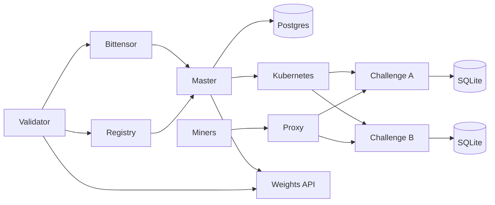
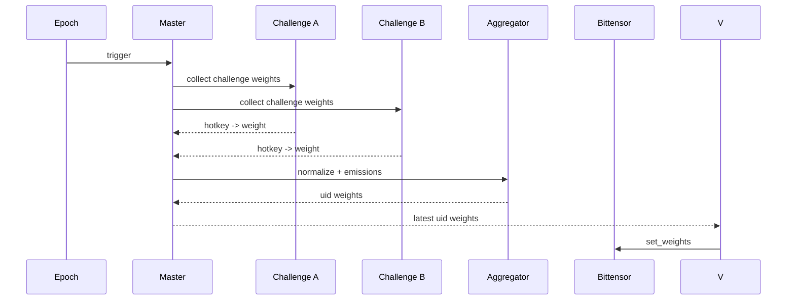

<div align="center">

# ρlατfοrm

**Multi-challenge Bittensor subnet platform with master/validator orchestration**

**[Miner Guide](docs/miner/README.md) • [Validator Guide](docs/validator/README.md) • [Foundation Master Guide](docs/master/README.md) • [Architecture](docs/architecture.md) • [Challenges](docs/challenges.md) • [Security](docs/security.md) • [Website](https://platform.network)**

[](https://github.com/PlatformNetwork/platform/actions/workflows/ci.yml)
[](https://github.com/PlatformNetwork/platform/blob/main/LICENSE)
[](https://bittensor.com/)


</div>

---

## Overview

Platform is a **multi-challenge Bittensor subnet platform**. It lets independent challenge
subnets run under one validator network, routes miner traffic to the right challenge, collects raw
challenge weights, normalizes emissions, maps miner hotkeys to Bittensor UIDs, and publishes the
final vector for validators to submit on-chain.

Each challenge lives in its own repository and owns its submissions, scoring logic, state, and
public miner experience. Platform provides the orchestration layer that makes those challenges run
together as one subnet.

## Core Principles

- One **Platform master validator** controls the central registry and orchestration.
- One repository and image per **challenge**, isolated from other challenges.
- Challenges expose a standard internal weight contract to Platform.
- Public challenge APIs are proxied through Platform without exposing internal control routes.
- Master PostgreSQL is private to the master process.
- Challenge state remains owned by each challenge.
- Validators can run all active challenge containers from the master registry.

---

## Documentation Index

- [Architecture](docs/architecture.md)
- [Miner guide](docs/miner/README.md)
- [Validator guide](docs/validator/README.md)
- [Foundation master guide](docs/master/README.md)
- [Challenges](docs/challenges.md)
- [Challenge Integration Guide](docs/challenge-integration.md)
- [Security Model](docs/security.md)
- [Validator Operations](docs/operations/validator.md)

---

## Network Architecture



---

## Weight Flow



---

## What Platform Does

Platform coordinates the full lifecycle of a multi-challenge subnet:

1. The master tracks active challenges and their emission shares.
2. Validators synchronize the challenge registry.
3. Challenge containers run isolated from the master and from each other.
4. Miners interact with the relevant challenge through Platform's public proxy.
5. Each challenge calculates raw hotkey weights from its own scoring rules.
6. Platform normalizes challenge outputs, applies configured emissions, and maps hotkeys to UIDs.
7. Validators fetch the master's final vector and submit weights to Bittensor at epoch boundaries.

If a challenge fails, Platform can isolate that challenge's contribution without taking down the
entire subnet.

## Roles

### Miners

Miners choose a challenge, follow that challenge's submission rules, and monitor challenge-specific
leaderboards through Platform.

### Challenge Owners

Challenge owners maintain independent repositories, images, scoring logic, public documentation, and
weight contracts.

### Validators

Validators run Platform, synchronize the registry, launch challenge containers, collect raw weights,
and submit final normalized weights to Bittensor.

---

## Repository Layout

```text
platform/
  src/platform_network/      # CLI, APIs, orchestration, Bittensor wrappers
  alembic/                   # PostgreSQL migrations
  config/                    # YAML example configs
  docker/                    # Dockerfiles and OCI image assets
  docs/                      # Project, miner, validator, and challenge docs
  plan/                      # Detailed design plan
  tests/                     # Unit/runtime validation tests
```


## Deployment Policy

Platform uses Kubernetes-only first-party deployment paths and keeps Dockerfiles for OCI images consumed by Kubernetes:

- `scripts/install-master.sh` is a Foundation-only installer for Cortex Foundation master infrastructure. Do not run this for validators or third-party operators. Its default namespace is `PLATFORM_NAMESPACE=platform-master`, and it installs master admin, proxy, broker, and `platform-master-config-sync` only.
- Normal validators must use `scripts/install-validator.sh` and the validator guide, not the foundation master installer.
- First-party Platform defaults use Kubernetes runtime, the Kubernetes broker backend, and an external PostgreSQL-compatible database URL.
- Production and Kubernetes deployments require an external PostgreSQL database provided through an explicit secret or URL. SQLite is rejected for Kubernetes control-plane state.
- The default Helm chart runs first-party master admin, proxy, broker, and config sync workloads from `ghcr.io/platformnetwork/platform-master:latest`, plus one-minute image updater CronJobs for those Deployments. The updaters resolve the public GHCR tag digest and patch Deployments to `tag@sha256:<digest>` only when the digest changes; no GHCR pull secret is required for public packages.
- Run an explicit validator release to deploy normal validator pods using `ghcr.io/platformnetwork/platform:latest`; validators fetch master-computed weights and perform final Bittensor submission.
- Pinned production mode still uses a semver tag plus a `sha256` digest, for example `ghcr.io/platformnetwork/demo:1.2.3@sha256:<64-hex-digest>`, and disables mutable auto-update. Production rejects `latest`, untagged images, missing digests, and `imageAutoUpdate.enabled=true`. Platform release versioning starts at `3.0.0`; see `docs/versioning.md` for the SemVer, Git tag, mutable `latest`/`main`, and GHCR tag policy.
- Production remote GPU servers and Kubernetes targets must keep `verify_tls=true`; `verify_tls=false` is only acceptable for clearly local or test-only endpoints.
- Multi-server and Kubernetes target routing trusts only enabled, healthy, non-draining targets with remaining GPU capacity. Production agent targets must use HTTPS and `verify_tls=true`; persisted insecure targets are rejected when production policy is active.
- Kubernetes broker jobs and challenge workloads map CPU and memory to PodSpec requests and limits. Docker-only `pids_limit`, `memory_swap`, and custom Docker network modes are rejected for Kubernetes because PID and swap enforcement belongs at the cluster or admission-policy boundary.
- Broker image allowlists should stay scoped to `ghcr.io/platformnetwork/` unless a deployment explicitly adds another trusted registry namespace.

Use `deploy/helm/platform/values.production.example.yaml` as the production policy fixture and keep examples aligned with Kubernetes deployment.

## Validation Quick Reference

Run these commands from the repository root when validating the platform locally. Some commands require Helm, kubeconform, kind, and kubectl. If a tool is missing, record the bounded blocker rather than claiming that surface was tested.

```bash
uv sync --extra dev --extra master
uv run ruff check .
uv run ruff format --check .
uv run mypy src tests
uv run pytest --cov=platform_network --cov-report=term-missing --cov-fail-under=80

helm lint deploy/helm/platform
helm template platform deploy/helm/platform > /tmp/platform-default.yaml
kubeconform -strict -summary /tmp/platform-default.yaml
helm template platform deploy/helm/platform -f deploy/helm/platform/values.production.example.yaml > /tmp/platform-production.yaml
kubeconform -strict -summary /tmp/platform-production.yaml

kind delete cluster --name platform-validation
kind create cluster --name platform-validation
kind get kubeconfig --name platform-validation > /tmp/platform-validation-kubeconfig
KUBECONFIG=/tmp/platform-validation-kubeconfig kubectl apply --dry-run=server -f /tmp/platform-default.yaml
KUBECONFIG=/tmp/platform-validation-kubeconfig kubectl apply --dry-run=server -f /tmp/platform-production.yaml
kind delete cluster --name platform-validation
```

Evidence for local validation should live in a local, gitignored evidence directory and must not contain kubeconfigs, tokens, credentialed database URLs, private registry credentials, bearer secrets, private keys, or Docker registry auth.

Current Task 12 evidence records the Python quality gates as passing without lowering the documented gates: `uv run ruff format --check .`, `uv run mypy src tests`, `uv run ruff check .`, and the full coverage command all pass. Historical Task 11 evidence recorded Ruff format and mypy blockers, but those blockers are resolved in the current validation state.

---

## License

Apache-2.0
