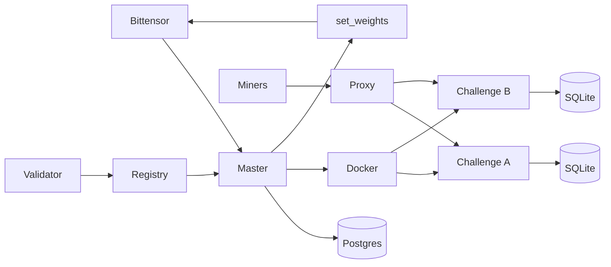
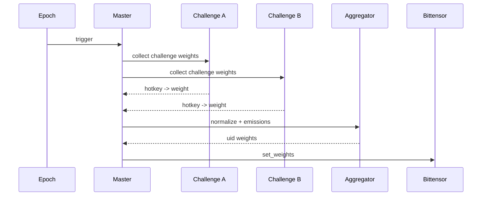

<div align="center">

# ρlατfοrm

**Multi-challenge Bittensor subnet platform with master/validator orchestration**

**[Miner Guide](docs/miner/README.md) • [Validator Guide](docs/validator/README.md) • [Architecture](docs/architecture.md) • [Challenges](docs/challenges.md) • [Security](docs/security.md) • [Website](https://platform.network)**

[](https://github.com/PlatformNetwork/platform/actions/workflows/ci.yml)
[](https://github.com/PlatformNetwork/platform/blob/main/LICENSE)
[](https://bittensor.com/)


</div>

---

## Overview

Platform is a **multi-challenge Bittensor subnet platform**. It lets independent challenge
subnets run under one validator network, routes miner traffic to the right challenge, collects raw
challenge weights, normalizes emissions, maps miner hotkeys to Bittensor UIDs, and submits final
weights on-chain.

Each challenge lives in its own repository and owns its submissions, scoring logic, state, and
public miner experience. Platform provides the orchestration layer that makes those challenges run
together as one subnet.

## Core Principles

- One **Platform master validator** controls the central registry and orchestration.
- One repository and image per **challenge**, isolated from other challenges.
- Challenges expose a standard internal weight contract to Platform.
- Public challenge APIs are proxied through Platform without exposing internal control routes.
- Master PostgreSQL is private to the master process.
- Challenge state remains owned by each challenge.
- Validators can run all active challenge containers from the master registry.

---

## Documentation Index

- [Architecture](docs/architecture.md)
- [Miner guide](docs/miner/README.md)
- [Validator guide](docs/validator/README.md)
- [Challenges](docs/challenges.md)
- [Challenge Integration Guide](docs/challenge-integration.md)
- [Security Model](docs/security.md)
- [Validator Operations](docs/operations/validator.md)

---

## Network Architecture



---

## Weight Flow



---

## What Platform Does

Platform coordinates the full lifecycle of a multi-challenge subnet:

1. The master tracks active challenges and their emission shares.
2. Validators synchronize the challenge registry.
3. Challenge containers run isolated from the master and from each other.
4. Miners interact with the relevant challenge through Platform's public proxy.
5. Each challenge calculates raw hotkey weights from its own scoring rules.
6. Platform normalizes challenge outputs, applies configured emissions, and maps hotkeys to UIDs.
7. Final weights are submitted to Bittensor at epoch boundaries.

If a challenge fails, Platform can isolate that challenge's contribution without taking down the
entire subnet.

## Roles

### Miners

Miners choose a challenge, follow that challenge's submission rules, and monitor challenge-specific
leaderboards through Platform.

### Challenge Owners

Challenge owners maintain independent repositories, images, scoring logic, public documentation, and
weight contracts.

### Validators

Validators run Platform, synchronize the registry, launch challenge containers, collect raw weights,
and submit final normalized weights to Bittensor.

---

## Repository Layout

```text
platform/
  src/platform_network/      # CLI, APIs, orchestration, Bittensor wrappers
  alembic/                   # PostgreSQL migrations
  config/                    # YAML example configs
  docker/                    # Dockerfiles and dev compose
  docs/                      # Project, miner, validator, and challenge docs
  plan/                      # Detailed design plan
  tests/                     # Unit/runtime validation tests
```

---

## License

Apache-2.0
