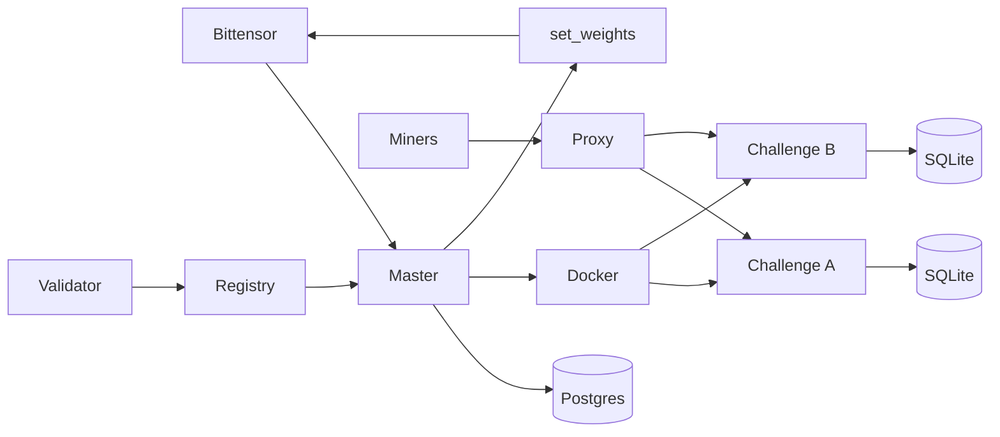
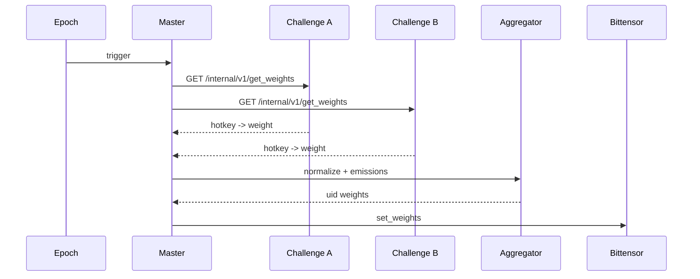

<div align="center">

# ρlατfοrm

**Multi-challenge Bittensor subnet platform with master/validator orchestration**

**[Validators](docs/validator.md) • [Architecture](docs/architecture.md) • [Challenges](docs/challenges.md) • [Security](docs/security.md) • [Website](https://platform.network)**

[](https://github.com/PlatformNetwork/platform/actions/workflows/ci.yml)
[](https://github.com/PlatformNetwork/platform/blob/main/LICENSE)
[](https://www.python.org/)
[](https://fastapi.tiangolo.com/)
[](https://bittensor.com/)


</div>

---

## Overview

Platform is a Python 3.12 implementation of a **multi-challenge Bittensor validator platform**. A master validator orchestrates independent challenge containers, exposes a registry and public challenge proxy, collects `get_weights` from each active challenge, normalizes emissions, maps hotkeys to UIDs, and submits final weights to Bittensor.

Each challenge lives in its own repository, ships its own GHCR Docker image, owns its SQLite state, and exposes a standard FastAPI contract for the master.

## Core Principles

- One **Platform master validator** controls the central registry and orchestration.
- One repo/image per **challenge**, isolated in Docker.
- Challenges expose only the standard internal `get_weights` contract to Platform.
- Public challenge APIs are proxied through `/challenges/{slug}/...`.
- Master PostgreSQL is private to the master process.
- Challenge state is persistent SQLite mounted as Docker named volumes.
- Validators can run all active challenge containers from the master registry.

---

## Documentation Index

- [Architecture](docs/architecture.md)
- [Validator Guide](docs/validator.md)
- [Challenges](docs/challenges.md)
- [Challenge Integration Guide](docs/challenge-integration.md)
- [Security Model](docs/security.md)
- [Validator Operations](docs/operations/validator.md)

---

## Network Architecture



---

## Weight Flow



---

## Quick Start

```bash
git clone https://github.com/PlatformNetwork/platform.git
cd ./platform
uv sync --extra dev
uv run pytest
uv run platform --help
```

Run the private master API:

```bash
uv run platform master run --config config/master.example.yaml
```

Run the public proxy API:

```bash
uv run platform master proxy --config config/master.example.yaml
```

Generate a new challenge repository:

```bash
uv run platform challenge create code-arena --out ../code-arena
```

Validate the project:

```bash
uv run ruff check .
uv run ruff format --check .
uv run mypy src
uv run pytest
```

---

## Challenge Contract

Every challenge image must expose:

- `GET /health`
- `GET /version`
- `GET /internal/v1/get_weights`
- optional public routes proxied via `/challenges/{slug}/...`

`get_weights` returns hotkey weights:

```json
{
  "challenge_slug": "code-arena",
  "weights": {
    "5F...hotkey": 1.0
  }
}
```

The master normalizes each challenge, applies fixed emission percentages, ignores unknown hotkeys, and sets a challenge contribution to zero if it fails.

---

## Repository Layout

```text
platform/
  src/platform_network/      # CLI, APIs, orchestration, Bittensor wrappers
  alembic/                   # PostgreSQL migrations
  config/                    # YAML example configs
  docker/                    # Dockerfiles and dev compose
  docs/                      # Project documentation and design notes
  tests/                     # Unit/runtime validation tests
```

---

## Status

Current validation suite:

- `ruff check`
- `ruff format --check`
- `mypy src`
- `mypy -p platform_network`
- `pytest`
- `docker compose config`
- rendered challenge template tests
