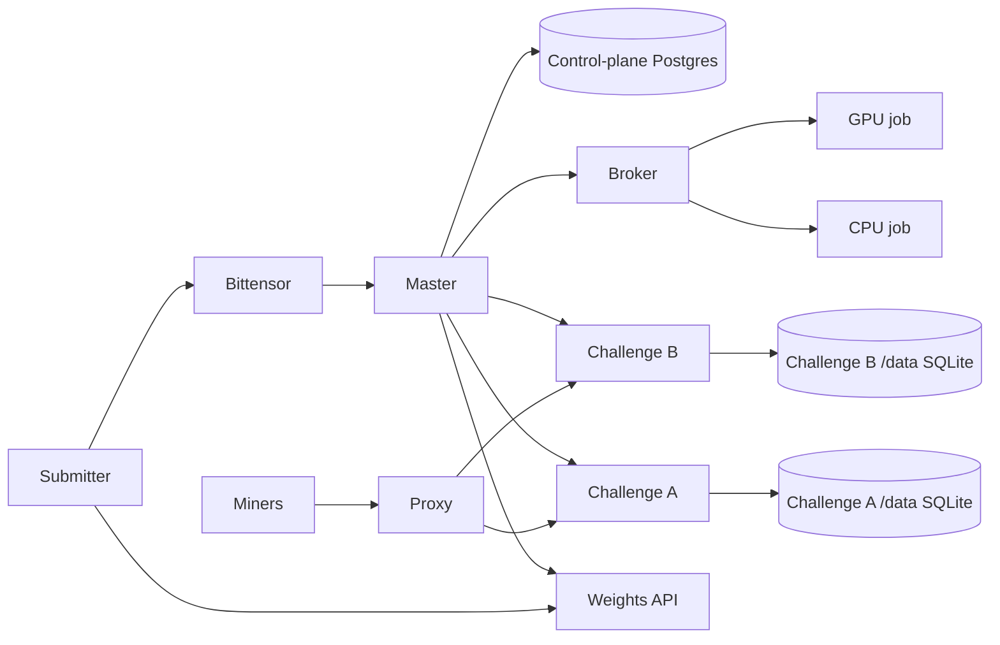
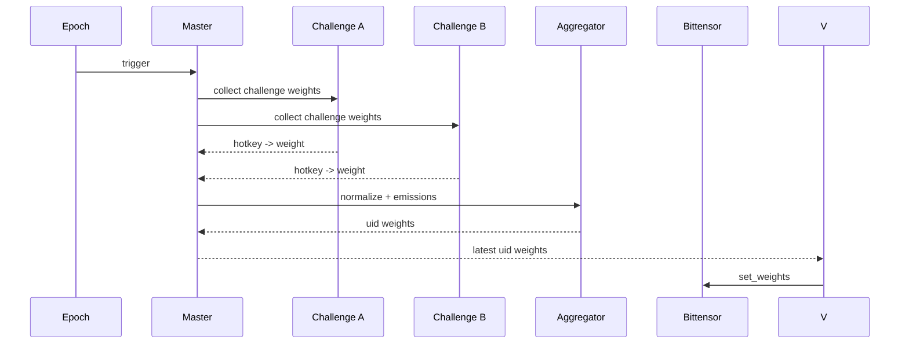

<div align="center">

# ρlατfοrm

**Multi-challenge Bittensor subnet platform with master/validator orchestration**

**[Miner Guide](docs/miner/README.md) • [Validator Guide](docs/validator/README.md) • [Foundation Master Guide](docs/master/README.md) • [Architecture](docs/architecture.md) • [Challenges](docs/challenges.md) • [Security](docs/security.md) • [Website](https://platform.network)**

[](https://github.com/PlatformNetwork/platform/actions/workflows/ci.yml)
[](https://github.com/PlatformNetwork/platform/blob/main/LICENSE)
[](https://bittensor.com/)


</div>

---

## Overview

Platform is a **multi-challenge Bittensor subnet platform**. It lets independent challenge
subnets run under one validator network, routes miner traffic to the right challenge, collects raw
challenge weights, normalizes emissions, maps miner hotkeys to Bittensor UIDs, and publishes the
final vector for validators to submit on-chain.

Each challenge lives in its own repository and owns its submissions, scoring logic, state, and
public miner experience. Platform provides the orchestration layer that makes those challenges run
together as one subnet.

Platform runs as a single Docker Swarm: a master (manager) node hosts the admin API, proxy, broker,
supervisor, and the challenge services, while manually enrolled worker nodes run short-lived
CPU/GPU evaluation jobs. There is no Kubernetes and no `runtime.backend` selector; the only backend
is Swarm.

## Core Principles

- One **Platform master** (Swarm manager) controls the central registry and orchestration.
- One repository and image per **challenge**, isolated from other challenges.
- Challenges expose a standard internal weight contract to Platform.
- Public challenge APIs are proxied through Platform without exposing internal control routes.
- The shared control-plane PostgreSQL is private to the master process.
- Each challenge keeps its own SQLite database on its `/data` Swarm volume.
- Challenge state remains owned by each challenge.
- The master node runs all active challenge services; the on-chain submitter only submits weights.

---

## Documentation Index

- [Architecture](docs/architecture.md)
- [Miner guide](docs/miner/README.md)
- [Validator guide](docs/validator/README.md)
- [Foundation master guide](docs/master/README.md)
- [Challenges](docs/challenges.md)
- [Challenge Integration Guide](docs/challenge-integration.md)
- [Security Model](docs/security.md)
- [Validator Operations](docs/operations/validator.md)

---

## Network Architecture



---

## Weight Flow



---

## What Platform Does

Platform coordinates the full lifecycle of a multi-challenge subnet:

1. The master tracks active challenges and their emission shares.
2. The master (manager) node runs the active challenge services from the registry.
3. Challenge services run isolated from the control plane and from each other, each on its own `/data` Swarm volume.
4. Miners interact with the relevant challenge through Platform's public proxy.
5. Each challenge calculates raw hotkey weights from its own scoring rules.
6. Platform normalizes challenge outputs, applies configured emissions, and maps hotkeys to UIDs.
7. The on-chain submitter fetches the master's final vector and submits weights to Bittensor at epoch boundaries.

If a challenge fails, Platform can isolate that challenge's contribution without taking down the
entire subnet.

## Roles

### Miners

Miners choose a challenge, follow that challenge's submission rules, and monitor challenge-specific
leaderboards through Platform.

### Challenge Owners

Challenge owners maintain independent repositories, images, scoring logic, public documentation, and
weight contracts.

### Validators

Validators run the on-chain submitter: they fetch the master's final normalized vector from the
weights API and submit it to Bittensor. Challenge services are run by the master (manager) node, not
by the submitter.

---

## Repository Layout

```text
platform/
  src/platform_network/      # CLI, APIs, orchestration, Bittensor wrappers
  alembic/                   # PostgreSQL migrations
  config/                    # YAML example configs
  docker/                    # Dockerfiles and OCI image assets
  docs/                      # Project, miner, validator, and challenge docs
  plan/                      # Detailed design plan
  tests/                     # Unit/runtime validation tests
```


## Deployment Policy

Platform uses a Docker Swarm only first-party deployment path and keeps Dockerfiles for the OCI images Swarm runs:

- `deploy/swarm/install-swarm.sh` brings up the single-node Swarm manager (master admin, proxy, broker, and challenge services on encrypted overlay networks). It is **dry-run by default**, mutates only with `--apply`, and keeps every destructive step behind its own explicit flag (`--restart-dockerd`, `--single-node-placement`, `--static-challenges`).
- `deploy/swarm/platform-supervisor.service` installs the manager-only systemd supervisor: broker-health, timeout-reaper, image-updater, challenge-image-updater, config-sync, and self-update loops.
- The master (manager) node runs the challenge services with the placement constraint `node.role==manager`. The broker dispatches CPU jobs to `node.labels.platform.workload==cpu` workers and GPU jobs (`gpu_count>0`) to `node.labels.platform.workload==gpu` workers with `--generic-resource NVIDIA-GPU=<N>`.
- Worker nodes are enrolled manually with Swarm join tokens (no SSH) via the `platform master worker` CLI group: `worker token [--cpu|--gpu]` prints `docker swarm join --token <TOKEN> <MANAGER_IP>:2377`; after the operator installs the matching `daemon.json` and joins, `worker label <node> --workload cpu|gpu` sets the scheduling label. The group also has `worker list`, `worker drain`, `worker rm`, and `worker inspect`.
- Control-plane state is a single shared PostgreSQL supplied via `PLATFORM_DATABASE_URL` or a Docker secret; SQLite is rejected for control-plane state. Each challenge keeps its own SQLite database on its `/data` Swarm volume; there is no Postgres server per challenge.
- The on-chain submitter (`deploy/swarm/submitter/`) is a systemd service that reads `/v1/weights/latest` and submits on-chain; it runs no challenge orchestration.
- The supervisor image-updater and challenge-image-updater resolve the public GHCR tag digest and roll Swarm services to `tag@sha256:<digest>` only when the digest changes from `ghcr.io/platformnetwork/platform-master:latest`; no GHCR pull secret is required for public packages.
- Pinned production mode uses a tag plus a `sha256` digest, for example `ghcr.io/platformnetwork/demo:1.2.3@sha256:<64-hex-digest>` for releases or `ghcr.io/platformnetwork/demo:latest@sha256:<64-hex-digest>` for the autonomous update channel, and disables mutable auto-update. Production rejects untagged images, missing digests, and non-SemVer non-`latest` tags. Platform release versioning starts at `3.0.0`; see `docs/versioning.md` for the SemVer, Git tag, mutable `latest`/`main`, and GHCR tag policy.
- Swarm networking uses encrypted overlay networks at MTU 1450. Required inter-node ports: `2377/tcp` (management), `7946/tcp+udp` (gossip), `4789/udp` (VXLAN data plane), and IP protocol 50 (ESP) for the encrypted overlay.
- Swarm services map CPU and memory to `--limit-cpu` and `--limit-memory` and PID ceilings to `--limit-pids`. `docker service create` does not support `--memory-swap` or `--security-opt`, so swap limits are not emitted and `no-new-privileges` is enforced daemon-wide via `daemon.json`.
- Broker image allowlists should stay scoped to `ghcr.io/platformnetwork/` unless a deployment explicitly adds another trusted registry namespace.

See `deploy/swarm/` for the installer, supervisor unit, submitter, and `daemon.json` templates that define the production deployment.

## PRISM Evaluation Data Plane

PRISM GPU evals re-execute the miner's training loop on locked FineWeb-Edu data under a forced random init. The broker delivers that locked data to the eval container through a **per-slug read-only mount** mechanism (`SwarmBrokerConfig.eval_readonly_mounts_by_slug` in `master/swarm_backend.py`, settings `docker.broker_eval_readonly_mounts_by_slug`, wired in `cli_app/main.py`) that is decoupled from the Docker-socket allowlist, so the prism eval job receives the data without the (root-equivalent) host Docker socket.

- Every prism GPU eval job bind-mounts the locked FineWeb-Edu **train** volume (`prism_fineweb_edu_train` → `/data/fineweb-edu/train`) and the offline reference tokenizers (`prism_reference_tokenizers` → `/opt/prism/reference-tokenizers`) **read-only**, via the built-in `DEFAULT_PRISM_EVAL_READONLY_MOUNTS` (no `master.yaml` entry required).
- Only the `train` split is exposed; the secret `val`/`test` held-out splits are never mounted into the eval container, which runs `network=none` on an internal overlay and carries no OpenRouter secret.

`deploy/swarm/install-swarm.sh` canonicalizes the PRISM v2 eval-plane deploy wiring on the challenge service:

- **Augmented evaluator image** — `IMAGE_PRISM_EVALUATOR` defaults to `ghcr.io/platformnetwork/prism-evaluator:augmented` (bundles `sentencepiece` + the offline tiktoken cache for the locked pipeline) and is passed as `PRISM_PLATFORM_EVAL_IMAGE`; the registry `:latest` evaluator is stale and must not be used.
- **Host-side held-out** — the manager-pinned prism scorer (not the `network=none` eval container) mounts the SECRET val split read-only (`prism_fineweb_edu_val` → `/secret/val`) and reads it via `PRISM_PLATFORM_EVAL_VAL_DATA_DIR=/secret/val` for the held-out delta; the held-out is gracefully skipped if val is absent.
- **OpenRouter LLM hard gate** — `PRISM_LLM_REVIEW_ENABLED=true`; the key is mounted on the challenge service ONLY at `/run/secrets/openrouter_api_key` (from the `platform_openrouter_api_key` Docker secret), never on the eval container.

See `deploy/swarm/README.md` for the full broker mount mechanism and deploy details.

## Validation Quick Reference

Run these commands from the repository root when validating the platform locally. The live Swarm checks require Docker. If a tool is missing, record the bounded blocker rather than claiming that surface was tested.

```bash
uv sync --extra dev --extra master
uv run ruff check .
uv run ruff format --check .
uv run mypy src tests
uv run pytest --cov=platform_network --cov-report=term-missing --cov-fail-under=80

bash -n deploy/swarm/install-swarm.sh
./deploy/swarm/install-swarm.sh            # dry-run: prints the planned docker swarm commands, changes nothing
```

For a live single-node check (mutating; run only on a disposable host):

```bash
docker swarm init
docker network create --driver overlay --opt encrypted \
  --opt com.docker.network.driver.mtu=1450 platform_challenges
docker service ls
docker swarm leave --force
```

Evidence for local validation should live in a local, gitignored evidence directory and must not contain tokens, credentialed database URLs, private registry credentials, bearer secrets, or private keys.

---

## Local E2E Multi-Challenge Integration (agent-challenge + Prism)

This section documents a local end-to-end (E2E) integration that runs two challenges together on a
single Docker Swarm: `agent-challenge` (terminal-bench code challenge, own_runner eval) and `prism`
(neural-architecture-search challenge, GPU eval). It proves the full pipeline end to end (real
submission, real eval, leaderboard, normalized `get_weights`) with weights computed in **dry-run
only**, never on-chain. Final scores may be low or zero; the goal is to prove the plumbing executes
submitted code, not that the agent or model is good.

The three repositories are sibling checkouts under a common parent (`platform/`, `agent-challenge/`,
`prism/`). The fixes that make them run together E2E live in those local checkouts (see the
reproducibility caveats below).

### Topology

A two-node Swarm named `next-terrier`:

- Manager node (CPU, label `platform.workload=cpu`) runs the control plane and the challenge APIs
  (each pinned with `node.role==manager`).
- A GPU worker node (RTX PRO 6000, label `platform.workload=gpu`) runs GPU eval jobs. It advertises
  the generic resource `NVIDIA-GPU` and sets `"default-runtime": "nvidia"` in its `daemon.json`. The
  GPU node joins the manager's swarm with a worker join token (leaving any prior standalone swarm
  first).

The live stack runs on the Swarm `host` network: services talk over `127.0.0.1` and bind fixed host
ports.

| Service | Port | Placement |
|---------|------|-----------|
| platform-master-proxy | 18080 | manager |
| platform-master-broker | 18082 | manager |
| platform-master-admin | 18900 | manager |
| platform-master-postgres | 15432 | manager (control-plane DB) |
| challenge-agent-challenge (plus worker sidecar) | 18001 | manager |
| agent-challenge postgres | 15433 | manager |
| challenge-prism | 18002 | manager (host-networked, SQLite-backed) |

GPU eval jobs are dispatched by the broker to the GPU worker via the constraint
`node.labels.platform.workload==gpu` plus `--generic-resource NVIDIA-GPU=<N>`.

### Prerequisites and environment

- A real OpenRouter API key supplied as the Docker secret `platform_or_key_real`, mounted into the
  prism challenge container at `/run/secrets/openrouter_api_key` (used by LLM review where enabled).
- GPU node: NVIDIA container toolkit, the `NVIDIA-GPU` generic resource advertised in `daemon.json`
  (`node-generic-resources`), and `"default-runtime": "nvidia"`. Without the default runtime, swarm
  GPU tasks land on the GPU node but the driver and `nvidia-smi` are not injected, because swarm
  services cannot set a per-service runtime.
- No-NAT bridge caveat: on this host the default docker0 bridge has no outbound NAT. agent-challenge
  own_runner bakes `tmux` into the task image at build time and falls back to `--network host` for
  build steps that need the network. Eval task containers run `--network none`. Tasks that require
  internet fail their verifier cleanly (terminal state, score 0) and are slow.

### Bring-up

`deploy/swarm/install-swarm.sh` is the canonical entry point. It is dry-run by default and mutates
only with `--apply`. It deploys the control plane (proxy 18080, broker 18082, admin 18900, master
Postgres 15432) and both challenges (challenge-agent-challenge on 18001 with its worker sidecar and
Postgres on 15433, challenge-prism on 18002). The script folds in the live deploy fixes: the proxy
submission-path config (secret-volume mount, upload allowlist, per-challenge token seeding written
as root then chowned to uid 1000), the agent-challenge worker sidecar and allowed-images, the broker
`node.role==manager` pin, and the prism `CHALLENGE_ENV` block (broker wiring,
`PRISM_PLATFORM_EVAL_IMAGE`, `PRISM_PLATFORM_EVAL_GPU_COUNT=1`, SQLite database URL, and the
dev-only `PRISM_ALLOW_INSECURE_SIGNATURES` and `PRISM_VALIDATOR_HOTKEYS`).

```bash
./deploy/swarm/install-swarm.sh            # dry-run: prints the planned docker swarm commands
./deploy/swarm/install-swarm.sh --apply    # apply on a disposable host
```

### Run and test

Each repo has its own `.venv`; the `--extra dev` is required or pytest, ruff, and mypy are stripped.

```bash
# install (all three sibling repos)
cd agent-challenge && uv sync --frozen --extra dev
cd ../prism        && uv sync --frozen --extra dev
cd ../platform     && uv sync --frozen --extra dev

# platform scoped tests, lint, and typecheck (from platform/)
.venv/bin/python -m pytest tests/unit -q -k "broker or swarm"
.venv/bin/ruff check src
.venv/bin/mypy src/platform_network/master
```

### Reproducibility caveats

- The code fixes for this integration were committed to the local checkouts of all three repos but
  NOT pushed to their remotes.
- The rebuilt agent-challenge images (`agent-challenge:own-runner-fixed` and
  `agent-challenge-terminal-bench-runner:own-runner-fixed`) and the broker/prism overlay images
  (`platform-master:cross-node-mount-fixed`, `prism:mount-fixed`) are local to the swarm nodes and
  not in any public registry. The prism evaluator image is pre-staged on the GPU node.
- A clean-room reproduce requires pushing those commits and rebuilding/publishing the images. The
  canonicalized deploy config in `install-swarm.sh` is image-independent and reproduces as-is.

---

## License

Apache-2.0
