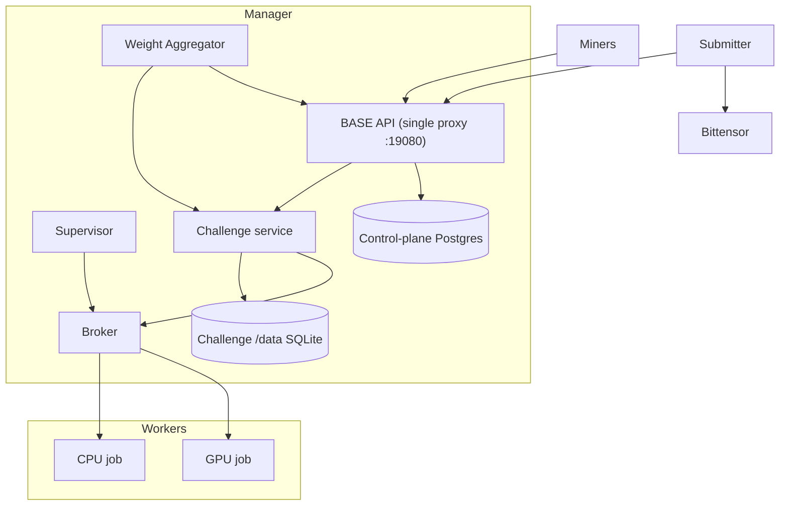

# Architecture

## Components

## Manager node

BASE runs as a single Docker Swarm. The manager node owns registry metadata, admin operations, the Swarm challenge lifecycle, challenge tokens, emission configuration, and final weight computation. The platform API (the single proxy on `:19080`) serves the computed vector through the public weights API at `/v1/weights/latest`; the on-chain submitter performs the Bittensor submission.

The manager hosts the platform API (a single proxy on `:19080` that serves the `/v1/registry` and `/v1/weights/latest` reads, the `/health` check, the `/challenges/*` passthrough, and the token-gated admin routes), the broker, the supervisor, and the challenge service containers themselves. Challenge code runs on the host, pinned with the placement constraint `node.role==manager`, so the long-lived challenge APIs share the manager node with the control plane.

Master and validator control-plane state uses a single shared PostgreSQL-compatible database URL (`BASE_DATABASE_URL`). That URL is private to the control-plane process and is never shared with challenge containers.

## Worker nodes

Worker nodes run short-lived evaluation work only. The broker on the manager dispatches CPU and GPU "jobs" as Swarm replicated-jobs (`--restart-condition none`, so an evaluation can never auto-restart) to the workers:

- CPU jobs are constrained to `node.labels.base.workload==cpu`.
- GPU jobs (broker `gpu_count > 0`) are constrained to `node.labels.base.workload==gpu` and request `--generic-resource NVIDIA-GPU=<N>`.

Workers are enrolled manually with a Swarm join token (no SSH). On the manager, `base master worker token [--cpu|--gpu]` prints a `docker swarm join --token <TOKEN> <MANAGER_IP>:2377` command. The operator installs the matching `daemon.json` on the worker and runs the join, then the manager labels the node with `base master worker label <node> --workload cpu|gpu`.

## Submitter

The on-chain submitter is a minimal submit-only process on the validator node. It reads `/v1/weights/latest` from the master, submits the fetched vector on-chain, and keeps retrying if the master is unavailable. It runs no challenge orchestration; all challenge services live on the manager.

## Challenge isolation

Each challenge runs as a Swarm replicated service with its own OCI image, internal shared token, public routes behind the BASE proxy, an encrypted overlay network, and a `/data` Swarm volume. Public proxy paths block internal challenge routes. Broker archive inputs are untrusted and are validated before extraction or resource creation.

Challenge state is SQLite on the challenge `/data` Swarm volume at `sqlite+aiosqlite:////data/challenge.sqlite3`. BASE no longer provisions a Postgres server per challenge; each challenge owns its `/data` volume for the SQLite database, artifacts, analyzer output, and local files. A challenge never receives the master or validator control-plane database credential.

By default the `/data` Swarm volume is retained when a challenge service is removed. Manual deletion of a retained volume is destructive and should be done only as an explicit operator purge.

## Deployment topology

First-party BASE deployments are Docker Swarm only. The manager is brought up with `deploy/swarm/install-swarm.sh`, which provisions the master proxy, broker, and challenge services on encrypted overlay networks, plus the systemd supervisor unit. Worker nodes are enrolled manually with join tokens and workload labels. There is no Helm chart, no Kubernetes manifests, and no `runtime.backend` selector: the only backend is Swarm.

Pinned production deployments should disable mutable auto-update and use rolling service updates, PostgreSQL control-plane state, per-challenge SQLite on the `/data` volume, and semver plus `sha256` digest image pins for control-plane and challenge images.

Swarm service resources map CPU and memory to `--limit-cpu` and `--limit-memory`, and PID ceilings to `--limit-pids`. `docker service create` does not support `--memory-swap` or `--security-opt`, so swap limits are not emitted and `no-new-privileges` is enforced daemon-wide via `daemon.json`.

### Swarm Broker GPU Contract

Broker clients request GPUs with `limits.gpu_count`. `gpu_count=None` or an omitted field means CPU-only and emits no GPU resource. A positive integer requests that many GPUs and is expressed as the Swarm generic resource `--generic-resource NVIDIA-GPU=<N>`. The resource name `NVIDIA-GPU` is case-sensitive and must match the `node-generic-resources` advertisement in the worker `daemon.json`.

GPU placement is node labels plus generic resources only. A GPU job is constrained to `node.labels.base.workload==gpu` and acquires a capacity lease before the service is created; the lease is released on cleanup or failure. There is no remote GPU HTTP agent and no device-ID scheduling. Device IDs, where present, are metadata for observability, not scheduling semantics, and this contract does not claim a TPU, AMD, or custom accelerator abstraction.

## Challenge database

The challenge runtime is SQLite-backed with `CHALLENGE_DATABASE_URL=sqlite+aiosqlite:////data/challenge.sqlite3`. The `/data` Swarm volume holds the SQLite file and challenge-local state. The single shared control-plane PostgreSQL is for master and validator state only and is never injected into a challenge.

## Out of scope

This implementation does not include a Postgres server per challenge, Docker Compose or stack-file deployment, automatic backups, restore workflows, high availability, connection pooling, storage resize workflows, challenge Alembic migration automation, or automated destructive purge.
