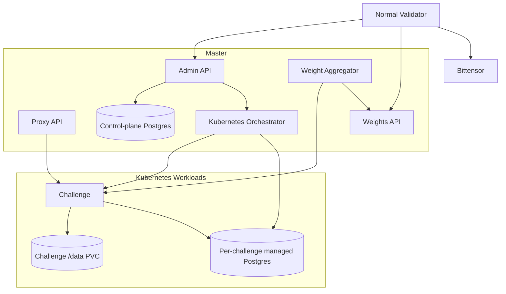

# Architecture

## Components

## Master validator

The master owns registry metadata, admin operations, Kubernetes challenge lifecycle, challenge tokens, emission configuration, and final weight computation. By default it serves the computed vector through the public weights API; normal validators perform Bittensor submission.

The master and validator control plane uses its own PostgreSQL-compatible database URL. That URL is not shared with challenge containers.

## Normal validator

Normal validators read `/v1/registry`, launch all active challenge images as Kubernetes workloads, fetch `/v1/weights/latest`, submit the fetched vector on-chain, and keep retrying if the master is unavailable.

Validator Kubernetes mode still requires a control-plane PostgreSQL URL for Platform state. This is distinct from the per-challenge managed Postgres credentials injected into challenge workloads.

## Challenge isolation

Each challenge runs as a Kubernetes workload with its own OCI image, internal shared token, public routes behind the Platform proxy, `/data` PVC, and managed Postgres resources. Public proxy paths block internal challenge routes. Broker archive inputs are untrusted and are validated before extraction or resource creation. Kubernetes broker cleanup attempts to remove the Job, NetworkPolicy, and mount Secret on success and failure paths.

In Kubernetes managed mode, Platform creates isolated managed Postgres resources per challenge slug. Each slug gets a separate Secret, Service, StatefulSet, and Postgres data claim. The challenge receives `CHALLENGE_DATABASE_URL` automatically from its own Secret. It never receives the master or validator control-plane database credential.

The challenge `/data` PVC remains separate from Postgres. It is for artifacts, analyzer output, local files, and the generated SQLite fallback. Managed Postgres stores data on its own StatefulSet claim.

By default, the managed Postgres Secret and data claim are retained when the challenge is removed. Manual deletion of those retained objects is destructive and should be done only as an explicit operator purge.

## Deployment Boundaries

First-party Platform deployments are Kubernetes-only. By default, Helm deploys the master admin, proxy, broker, config sync, and master image updater resources only. Validator workloads require an explicit validator release; those validators fetch master-computed weights and perform the final Bittensor submission.

Pinned production deployments should disable mutable auto-update and use rollout controls, scoped RBAC, external PostgreSQL for control-plane state, managed per-challenge Postgres for Kubernetes challenge state, and semver plus `sha256` digest image pins for control-plane and challenge images.

Kubernetes CPU and memory requests and limits map to PodSpec fields. Docker-only `pids_limit`, `memory_swap`, and custom Docker network modes do not have parity in this path, so non-default requests are rejected or handled by cluster and admission policy outside Platform.

Multi-server and Kubernetes target routing trusts only enabled, healthy, non-draining targets with remaining GPU capacity. Production agent targets require HTTPS and `verify_tls=true`; stale or insecure persisted assignments are not trusted under production policy.

## Legacy Docker behavior

The legacy Docker runtime stays SQLite-backed with `CHALLENGE_DATABASE_URL=sqlite+aiosqlite:////data/challenge.sqlite3`. It mounts `/data` for challenge-local state and does not create Postgres.

## Out of scope

This implementation does not include compose-file Postgres support, automatic backups, restore workflows, high availability, connection pooling, Postgres operator support, storage resize workflows, challenge Alembic migration automation, or automated destructive purge.
