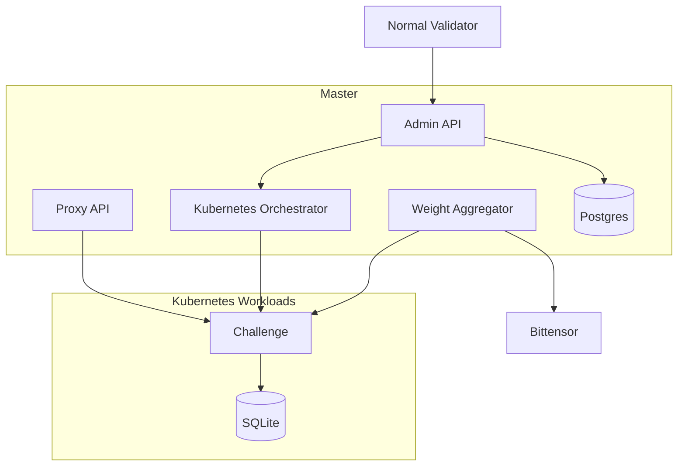

# Architecture

## Components

## Master validator

The master owns registry metadata, admin operations, Kubernetes challenge lifecycle, challenge tokens, emission configuration, and final Bittensor weight submission.

## Normal validator

Normal validators read `/v1/registry`, launch all active challenge images as Kubernetes workloads, and keep retrying if the registry is unavailable.

## Challenge isolation

Each challenge runs as a Kubernetes workload with its own OCI image, persistent SQLite storage, internal shared token, and public routes behind the Platform proxy. Public proxy paths block internal challenge routes. Broker archive inputs are untrusted and are validated before extraction or resource creation. Kubernetes broker cleanup attempts to remove the Job, NetworkPolicy, and mount Secret on success and failure paths.

## Deployment Boundaries

First-party Platform deployments are Kubernetes-only. Default Helm deployments use mutable GHCR `latest` images plus one-minute digest-checking updater CronJobs for master and validator workloads. Pinned production deployments should disable mutable auto-update and use rollout controls, scoped RBAC, external PostgreSQL, and semver plus `sha256` digest image pins for control-plane and challenge images.

Kubernetes CPU and memory requests and limits map to PodSpec fields. Docker-only `pids_limit`, `memory_swap`, and custom Docker network modes do not have parity in this path, so non-default requests are rejected or handled by cluster and admission policy outside Platform.

Multi-server and Kubernetes target routing trusts only enabled, healthy, non-draining targets with remaining GPU capacity. Production agent targets require HTTPS and `verify_tls=true`; stale or insecure persisted assignments are not trusted under production policy.
